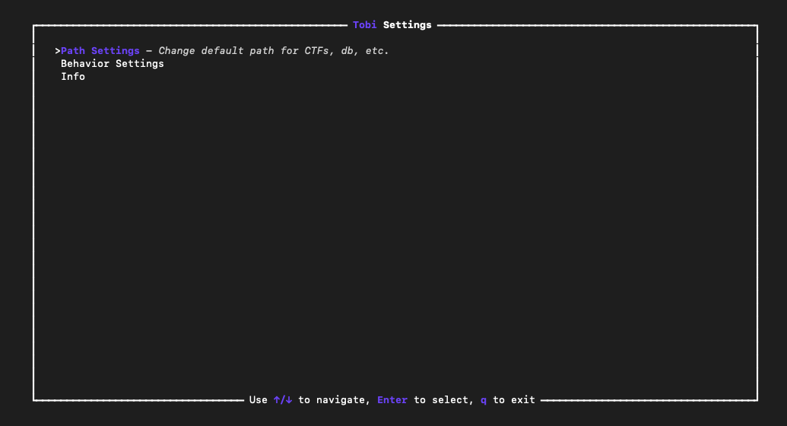

# TOBI

**Warning**: This is a work in progress. The current version is usable, however not fully featured, not tested in a production environment nor guaranteed to work as expected.

Tobi is a CLI tool designed to help with organizing and managing CTF challenge workspaces.

Command map:
- `tobi ctf` - change dir to the current CTF workspace(if no chall is in scope, it will change to the CTF base dir)
    - `tobi ctf <ctf_name/chall_name>` - change dir to the specified CTF workspace
    - `tobi ctf <ctf_name> <chall_name>` - change dir to the specified challenge workspace

        Note: `tobi ctf` will **NOT** change context, only the directory

- `tobi new`
    - `ctf <ctf_name>` - creates a new CTF workspace and switches CTF context to it
    - `<chall_category> <chall_name>` - creates a new challenge workspace and switches context to it

- `tobi list` - list all challenges in the current context
    - `all` - lists all ctfs and all challenges
    - `ctf` - list all ctf names
    - `<ctf_name>` - lists all challenges in the specified CTF
    - `flags` - lists all the flags in the current challenge workspace

- `tobi context` - prints the current context and a couple stats(Notice similarity to `tobi ctf`. The latter is for changing directories, the former is for changing the context)
    - `<ctf_name/chall_name>` - switches the current context to the specified CTF workspace
    - `<ctf_name> <chall_name>` - switches the current context to the specified challenge workspace

- `tobi solve <flag>` - marks the current challenge as solved and saves the flag. If you want to change the flag, you can simply run this command again with the new flag
- `tobi unsolve` - marks the current challenge as unsolved

- `tobi undo` - undoes the last action

    Note: An example use case for `tobi undo` is checking out some other CTF files. When it's time to go back to the context directory, instead of typing the challenge name, you can simply run this command and it will take you back.

- `tobi settings` - opens TUI settings menu

## Installation
Because changing the shell's directory from a running child process is not possible, `tobi` uses a wrapper bash script. This declares a helper function that ingests `tobi-cli`(the actual binary) output and changes the directory if needed. `tobi` wrapper is sourced in the shell's rc file.

Note: Tobi also supports `tab auto-completion`. The wrapper script contains the auto-completion function.

To install `tobi` clone the repo and simply run the install script with the needed arguments:
```bash
./install.sh --install-dir=<desired_install_dir> --rc-file=<shell rc file>

# Example:
./install.sh --install-dir=/opt/scripts --rc-file=$(realpath ~/.zshrc)
```

## Settings

Tobi settings feature a TUI interface implemented in [ratatui](https://ratatui.rs). You can customize stuff like where tobi stores it's database or where CTF and challenge workspaces are created. It's also possible to customize the behavior of the `tobi` command.

Main menu:



### TODO:
- [x] Implement directory switching
- [x] Challenge name parsing
- [x] Make context command accept a single parameter and determine if it is a ctf or chall(return option if multiple challs with same name)
- [x] Add checkboxes to `tobi list` output if the challenge is solved
- [x] Implement undo command
- [x] Implement flag/solve command
- [x] Implement auto completion
- [ ] Backup db to some cloud service(will look into this later)
- [ ] Implement TUI settings menu
- [ ] Create custom scripts for a workspace or for all workspaces
- [ ] Remote pwn environment integration
- [ ] Beautify prints
- [ ] Make `tobi` command customizable
- [ ] Add setting to automatically switch directory when switching context